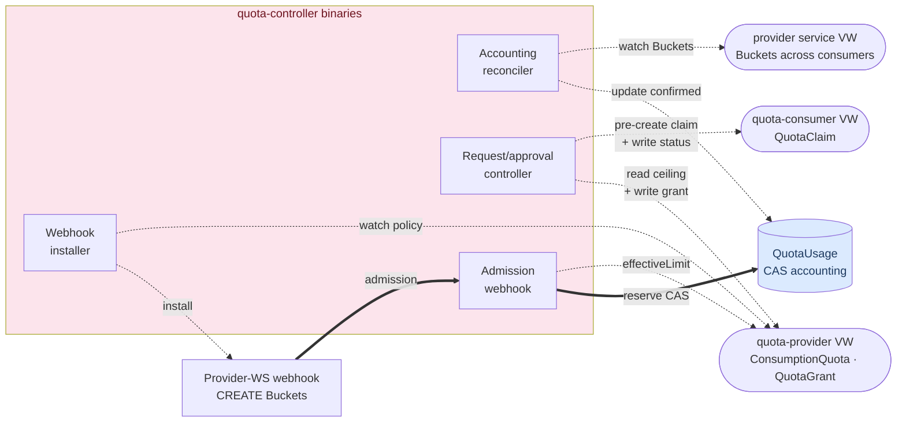
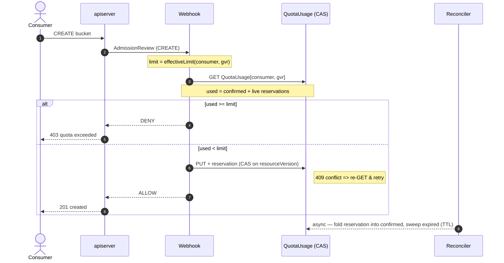
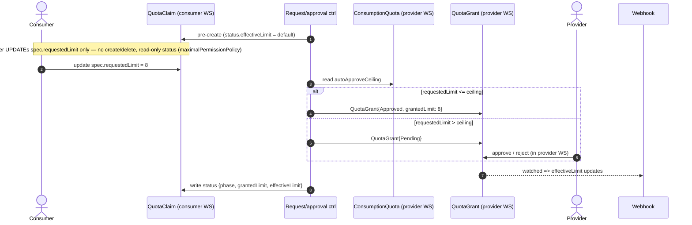
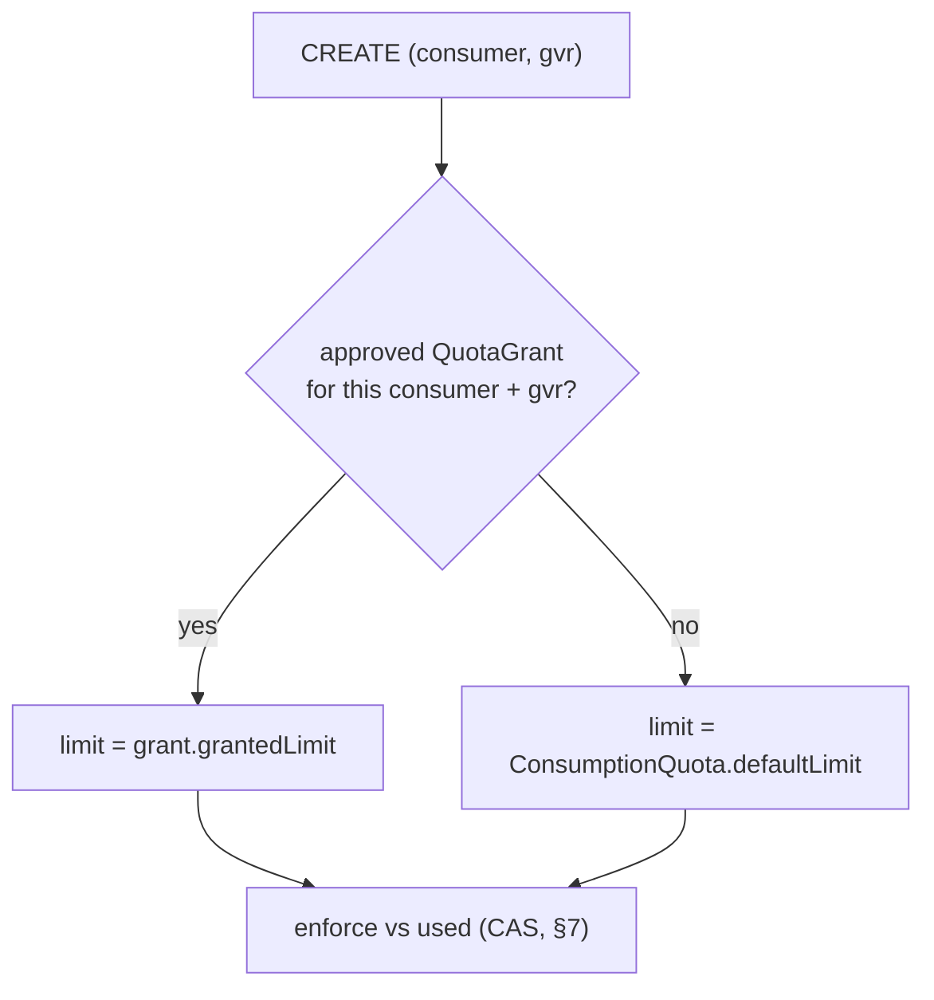

# kcp Consumption Quota — Design

**Status:** Draft (brainstorming output, pending review)

**Date:** 2026-06-29 (revised 2026-07-01 to add the self-service request/approval layer)

**Related work:** [`dependency-controller`](https://github.com/opendefensecloud/dependency-controller) — this design deliberately reuses its topology, RBAC model, and webhook-installation machinery.

**Decision records:** [ADR-001](../../../architecture/ADR-001-external-cas-quota-enforcement.md) (enforcement mechanism), [ADR-002](../../../architecture/ADR-002-self-service-quota-requests.md) (self-service request/approval).

> **Implementation status (2026-07-03):** this spec designs all of Iteration 1, but delivery is
> split. **Iteration 1a — count enforcement — is implemented and deployed.** **Iteration 1b — the
> self-service request/approval workflow (§§ below + ADR-002) — is designed but NOT yet
> implemented** (no plan exists for it). Iteration 2 (aggregate quotas) is designed-for only. The
> enforcement plan calls 1a/1b "Phase 1/Phase 2". See the README "Status / Roadmap" for the
> canonical status table.

## 1. Problem

In a [kcp](https://kcp.io) environment, service providers expose APIs via `APIExport`s.
Consumer workspaces bind to one or more provider `APIExport`s and create instances of the
exported types in their own workspaces.

The provider needs to **cap how many instances each consumer workspace may create**, defined
**by the provider**. On top of that, consumers should be able to **self-service** — request a
higher cap, which the provider can approve or reject (or which is auto-approved under a
provider-set ceiling) — and **see** their current cap and the state of any request.

- **Iteration 1 (this spec):** cap by **count** *(1a — **implemented**)*, plus the full
  self-service workflow *(1b — **designed, not yet implemented**)*.
- **Iteration 2 (designed for, not built):** cap by an **aggregate property** — e.g. buckets
  with aggregated size < 1 TiB.

## 2. Requirements (decided during brainstorming)

| # | Requirement | Decision |
| --- | --- | --- |
| R1 | Enforcement strictness | **Strict — the limit may never be exceeded, even momentarily.** |
| R2 | What is capped | **Admitted API objects.** The `CREATE` must be rejected at the API. |
| R3 | Threat model | **Adversarial consumers, no consumer-workspace RBAC control.** Enforcement authority must live outside the consumer workspace. |
| R4 | Limit granularity | Single **default** limit per resource type, plus per-consumer **grants** (overrides) driven by the request workflow. |
| R5 | Counting scope | **Per consumer workspace** (logical cluster), across all its namespaces. *(Per-namespace: future, §13.)* |
| R6 | Availability posture | **Fail-closed.** While the webhook is unavailable, governed `CREATE`s are rejected. |
| R7 | Quota authorship | Provider-defined, created alongside the provider's `APIExport`. |
| R8 | Self-service requests | Consumers can **request** a higher cap for a resource kind. |
| R9 | Approval | Providers can **approve/reject** pending requests **in their own workspace**; requests at/below a provider-set **auto-approve ceiling** are granted automatically. |
| R10 | Abuse prevention | Consumers cannot self-grant. Enforced structurally (enforcement reads only provider-workspace objects) **and** via kcp `maximalPermissionPolicy` (consumers may write the request `spec` but only read `status`). |
| R11 | Consumer visibility | Consumers can **see** their current effective limit and whether a request is Pending/Approved/Rejected, out-of-the-box. |

## 3. Decision summary & alternatives considered

R1–R3 compose into a hard conclusion that eliminates the simpler enforcement options
(full rationale in [ADR-001](../../../architecture/ADR-001-external-cas-quota-enforcement.md)):

- **Injected `ResourceQuota` in the consumer workspace** — atomic, but **rejected** by R3:
  it lives in the consumer's own workspace and an adversarial admin would edit it.
- **Stateless live-count webhook** — **rejected** by R1: a live `LIST` races against
  not-yet-persisted creates (TOCTOU).
- **Actuation-gating** (admit, but refuse to provision beyond N) — **rejected** by R2: caps
  provisioned resources, not admitted objects.

**Chosen enforcement:** an external, stateful admission webhook in the provider workspace,
authoritative accounting in a persisted `QuotaUsage` object, slots reserved via
optimistic-concurrency (CAS). The **self-service layer** (R8–R11) sits *on top*: it only
changes how the webhook resolves the *effective limit* — the CAS mechanism is untouched.

### Honest caveat on atomicity

No external webhook is truly atomic with the apiserver write the way native `ResourceQuota`
is. Strictness comes from the webhook being the **sole serialization point** for governed
`CREATE`s across all shards, CAS on a single accounting object, and fail-closed. The
reservation mechanism (§7) closes the TOCTOU race a live count cannot.

## 4. Topology

Reuses the dependency-controller layout. The quota-system now owns **two** `APIExport`s and
one internal type.

```text
quota-ctrl WS
  ├─ APIExport: quota-provider   → ConsumptionQuota, QuotaGrant
  │     + permissionClaim: validatingwebhookconfigurations
  ├─ APIExport: quota-consumer   → QuotaClaim
  │     + maximalPermissionPolicy: consumers may write quotaclaims, read-only on quotaclaims/status
  └─ CRD (internal, not exported): QuotaUsage   ← authoritative accounting, outside consumer reach

provider WS
  ├─ APIBinding: quota-provider  (permissionClaim accepted)
  ├─ APIExport: <their service>  (e.g. s3.example.com → buckets)
  ├─ ConsumptionQuota            (default limit + auto-approve ceiling for buckets)
  ├─ QuotaGrant                  (per-consumer approved/pending overrides — provider approves HERE)
  └─ ValidatingWebhookConfiguration  ← installed by the controller (CREATE on buckets)

consumer WS
  ├─ APIBinding: <provider service>   creates Buckets
  ├─ APIBinding: quota-consumer       gets the QuotaClaim type
  └─ QuotaClaim                       requests + reads current limit/status (status is read-only to them)
```

**Runtime control-flow** (who watches / writes / installs what; the ASCII above shows where
objects live and bindings; thick arrows are the admission hot path):



**Reused core trick:** the `ValidatingWebhookConfiguration` installed in the *provider*
workspace intercepts operations on the exported type across **all** consumer workspaces bound
to that provider, and consumers can't tamper with it. Same as dep-ctrl's deletion protection,
applied to `CREATE`.

## 5. Components

Three binaries' worth of responsibilities; the controller and both reconcilers can share the
`cmd/controller` binary, with the admission webhook as a separate `cmd/webhook` (mirrors
dep-ctrl).

### 5.1 Webhook installer (controller)

Reuses dep-ctrl's `WebhookInstaller`, retargeted: watches `ConsumptionQuota` via the
quota-provider VW and installs/updates a `ValidatingWebhookConfiguration` (scoped to
**`CREATE`** on the governed GVR) in the provider workspace, authorized by the
`validatingwebhookconfigurations` permissionClaim. Path→logicalCluster resolution unchanged.

### 5.2 Accounting reconciler

Watches the **governed objects across all consumers via the provider's service `APIExport`
virtual workspace** (single cross-consumer watch stream) and maintains `status.confirmed` in
each `QuotaUsage`; folds in / TTL-sweeps reservations (§7). Owns `confirmed` only. Should be
leader-elected; its writes are idempotent.

### 5.3 Request/approval controller (new)

The self-service bridge. Responsibilities:

- **Visibility (R11):** ensures a `QuotaClaim` exists in each consumer workspace for every
  governed resource that consumer can access, with `status.effectiveLimit` populated. Writes
  via the quota-consumer VW (the export owner implicitly has access to instances of its
  exported type — including the `status` subresource — in binding workspaces).
- **Request handling (R8/R9):** on a `QuotaClaim.spec.requestedLimit` change, resolves the
  owning provider (via the governed resource → its `ConsumptionQuota`), reads
  `autoApproveCeiling`, and writes a `QuotaGrant` in the provider workspace — `Approved`
  automatically if `requestedLimit ≤ ceiling`, else `Pending` for manual action. Writes via
  the quota-provider VW.
- **Write-back:** on a `QuotaGrant` decision change (auto or provider), updates the effective
  limit (consumed by the webhook, §9) and writes `QuotaClaim.status`
  (`phase`, `grantedLimit`, `effectiveLimit`, `reason`).

### 5.4 Webhook (admission)

On each `CREATE`: resolves the effective limit for `(consumerCluster, gvr)` from an in-memory
registry (see §9), then `GET`/create-and-CAS the one `QuotaUsage` object in the quota-ctrl
workspace (§7). It does **not** list consumer resources and needs **no** broad cross-workspace
read RBAC. Consumer identified from the `kcp.io/cluster` admission annotation.

## 6. Data model (CRDs)

**Resource identity (kcp convention).** A resource served through an `APIExport` is identified
not by `group/resource` alone but by the export's identity — kcp writes it to
`APIExport.status.identityHash` and addresses the resource as `resource.group:identityHash`
(see the SDK's `GRIString`/`EqualGRI` and `PermissionClaim.identityHash`). Two providers can
export the same `group/resource`, so **every governed-resource reference in these CRDs carries
the identity tuple `(group, resource, identityHash)`**, and `QuotaUsage` / the webhook registry
are keyed by it. The `ConsumptionQuota` controller resolves `identityHash` from the governed
`APIExport.status.identityHash` (the provider's own export, in the same workspace) and stamps it
onto the policy status and every derived `QuotaGrant` / `QuotaClaim`, so consumers and the
webhook never have to guess it. Any `permissionClaim` we make on a governed resource likewise
carries its `identityHash`.

### 6.1 `ConsumptionQuota` — provider policy (provider WS, quota-provider export)

```yaml
apiVersion: quota.opendefense.cloud/v1alpha1
kind: ConsumptionQuota
metadata:
  name: bucket-quota
spec:
  governed:
    apiExportName: s3.example.com    # APIExport in the same workspace as this policy
    group: s3.example.com
    version: v1alpha1
    resource: buckets
  by: Count                          # enum; iteration 1 = Count
  defaultLimit: 3                    # every consumer starts here (no grant needed)
  autoApproveCeiling: 10             # requests ≤ this are auto-granted; above → manual (omit/0 = always manual)
  # iteration 2 (by: Sum) will add: fieldRef {path: .status.sizeBytes}, quantities with units
status:
  identityHash: a1b2c3…              # resolved by the controller from the governed APIExport.status.identityHash
```

### 6.2 `QuotaGrant` — provider decision / override (provider WS, quota-provider export)

One per `(consumer, governed resource)`. The provider approves/rejects **here**, in their own
workspace; the controller may pre-create it (`Pending`) or write it (`Approved`) on
auto-approve; providers may also create grants proactively. **Enforcement's override source.**

```yaml
spec:
  consumer: <consumer logical cluster>
  governedRef: { name: bucket-quota }     # the ConsumptionQuota it overrides
  governed:                               # identity tuple, stamped by the controller
    group: s3.example.com
    resource: buckets
    identityHash: a1b2c3…
  requestedLimit: 8                       # mirrored from the claim (informational for the provider)
  grantedLimit: 8                         # set on approval
  decision: Approved                      # Pending | Approved | Rejected
  reason: "team scaled up"
status:
  phase: Approved
  appliedAt: "2026-07-01T09:00:00Z"
```

### 6.3 `QuotaClaim` — consumer request + view (consumer WS, quota-consumer export)

**Controller-created, consumer-update-only.** The controller pre-creates one `QuotaClaim` per
`(consumer, governed resource)` (with the identity stamped in); consumers may **only update**
`spec.requestedLimit` — they cannot `create` or `delete` claims, nor write `status`. This is
enforced by `maximalPermissionPolicy` (§10) and means the set of claims is provider-controlled,
not consumer-spawnable.

```yaml
spec:
  governed: { group: s3.example.com, resource: buckets, identityHash: a1b2c3… }  # stamped by controller
  requestedLimit: 8            # the ONLY field consumers may change; omit = "just show me my limit"
status:                         # controller-written; read-only to consumers via maximalPermissionPolicy
  phase: Approved              # None | Pending | Approved | Rejected
  effectiveLimit: 8           # what the webhook will actually enforce right now
  grantedLimit: 8
  reason: "auto-approved (≤ ceiling)"
  lastTransitionTime: "2026-07-01T09:00:00Z"
```

### 6.4 `QuotaUsage` — internal accounting (quota-ctrl WS, not exported)

Keyed by `(consumerCluster, group, resource, identityHash)`. Accounting only — the limit lives
in the policy/grant, resolved by the webhook (§9). The identity in the key is what keeps two
providers' same-named resources in separate ledgers.

```yaml
status:
  confirmed: 2                 # owned by reconciler = real live object count
  reservations:                # small list, in-flight admits not yet observed
    - key: "ns-a/my-bucket"
      expiresAt: "2026-07-01T10:00:30Z"
```

## 7. Enforcement protocol (CAS reservations)

Unchanged from the pre-self-service design; this is what makes strict enforcement possible
from outside the apiserver.

**Effective usage:** `used = confirmed + len(live reservations)`.

**Why not just count live objects?** An admission webhook answers *before* the object is
persisted, so two concurrent `CREATE`s at 2/3 both see "2" and are both allowed → 4. A live
`LIST` cannot see the not-yet-written object that would push it over (a TOCTOU race). The fix
is to record an intent — a **reservation** — the instant we allow, so the *next* concurrent
request sees it. That is why usage is split in two: `confirmed` is what the reconciler has
actually observed as live objects; `reservations` are admits allowed but not yet observed (each
carrying a TTL).

**What CAS buys.** The webhook increments `QuotaUsage` with a `resourceVersion` precondition
(compare-and-swap / optimistic concurrency). etcd accepts only the first of two racing writers;
the loser gets a `409 Conflict`, re-reads, and re-evaluates. etcd thus serializes the decision
for us — no leader election, no in-process lock — and multiple webhook replicas stay correct.

**Worked example** — limit 3, `confirmed=2`, no reservations, two creates race:

- **A:** `GET` (rv=10, used=2 < 3) → `PUT` +reservation with rv=10 → **OK**, object now rv=11 → ALLOW
- **B:** `GET` (rv=10, used=2 < 3) → `PUT` +reservation with rv=10 → **409** (A moved it to rv=11) → re-`GET` (rv=11, used=3) → **DENY**

No overshoot. If an allowed create later fails downstream, its reservation is never folded into
`confirmed` and is swept after the TTL (§7.4) — the slot briefly stays held (errs strict), never
double-granted.



### 7.1 Webhook — on `CREATE`

```text
key   := (consumerCluster from kcp.io/cluster, group, resource, identityHash)
limit := effectiveLimit(key)                     # §9, from in-memory registry
# identityHash comes from the webhook's registry entry (the ConsumptionQuota that installed
# this rule), NOT from the admission request — so it is unambiguous even if another provider
# exports the same group/resource.
retry on conflict:
    u := GET QuotaUsage[key]            # create with confirmed=0 if absent
    used := u.status.confirmed + countLive(u.status.reservations)
    if used >= limit:
        DENY  "quota exceeded: N/N <resource> in use for this workspace"
    append reservation {key: ns/name, expiresAt: now + TTL}
    PUT u  (with observed resourceVersion)   # compare-and-swap
    on 409 conflict: retry
    on success: ALLOW
```

Concurrent admits — across replicas or in-flight requests — serialize through etcd's CAS on
`resourceVersion`. The limit cannot be crossed.

### 7.2 Reconciler — maintaining truth

`confirmed` is the reconciler's responsibility. A reservation set by the webhook has exactly
**two fates**, and only one of them is expiry:

- **Fulfilled (the normal path) — folded, not expired.** When the real object appears, the
  reconciler sets `confirmed = trueCount` **and removes the matching reservation** (matched by
  its `key`, `ns/name`) in a single CAS write. This is a hand-off: `used` is unchanged across
  the moment (`reservations` −1, `confirmed` +1), and the `key` match is what prevents
  double-counting the object during the swap. A successful reservation is gone well before its
  TTL is ever consulted.
- **Orphaned — expired via TTL.** If an admitted create failed downstream (another webhook
  denied it, schema error, etc.), no object ever appears, so nothing folds the reservation. It
  keeps counting toward `used` until `expiresAt`, when the periodic sweep drops it and frees
  the slot. This is the *only* case where the TTL matters.
- **Object deleted:** `confirmed = trueCount` (lowers usage).
- **Periodic resync:** `confirmed = trueCount` from the informer cache, plus the orphan sweep
  above.

Because a fulfilled reservation must survive until its object is observed, the TTL must exceed
the worst-case admit→observe latency (§7.4). Too long merely over-holds an orphaned slot
(harmless over-strictness); too short could sweep a real object's reservation before `confirmed`
catches up, briefly dipping `used` and opening an overshoot gap — hence the deliberate bias
toward a longer TTL.

### 7.3 Why this is correct

- **No overshoot (R1):** a reservation is only appended when `used < limit`, under CAS;
  in-flight admits are counted via `reservations`, which a live `LIST` would miss.
- **No permanent leak:** failed creates' reservations expire (TTL); successful ones fold into
  `confirmed`. A slot is briefly held (errs strict), never double-granted.
- **Restart-safe / multi-replica:** state lives in `QuotaUsage`; CAS makes concurrent webhook
  replicas safe with no leader election (only the reconciler benefits from leadership).

### 7.4 TTL choice

TTL must exceed worst-case admit→observe latency (create + watch propagation) yet be short
enough to free slots from failed creates promptly. Start ~60s; bias toward the longer, strict
side (too short risks a momentary over-allow; too long only over-holds a failed slot).

## 8. Self-service request / approval flow

```text
1. Controller ensures QuotaClaim exists in consumer WS (status.effectiveLimit = default).   [R11]
2. Consumer sets QuotaClaim.spec.requestedLimit = 8.                                         [R8]
       maximalPermissionPolicy: consumer may write spec, NOT quotaclaims/status.            [R10]
3. Controller resolves provider + reads ConsumptionQuota.autoApproveCeiling.
       requestedLimit ≤ ceiling → write QuotaGrant{decision: Approved, grantedLimit: 8}.    [R9 auto]
       requestedLimit > ceiling → write QuotaGrant{decision: Pending}.                       [R9 manual]
4. (manual path) Provider edits QuotaGrant in THEIR workspace → Approved/Rejected.           [R9]
5. Controller observes the grant decision:
       → effective limit for (consumer, buckets) updates (webhook picks it up, §9).
       → writes back QuotaClaim.status {phase, grantedLimit, effectiveLimit, reason}.        [R11]
```



**Abuse prevention (R10), defense in depth:**

- Enforcement reads **only** provider-workspace objects (`ConsumptionQuota` + `QuotaGrant`).
  A consumer-workspace object never affects the enforced limit.
- `maximalPermissionPolicy` on the quota-consumer export caps consumers to **updating**
  `spec.requestedLimit` on the controller-pre-created claims and **reading** `quotaclaims/status`
  — they cannot `create` or `delete` claims (no claim-spam / no deleting the record), and cannot
  forge a decision in `status`. The controller (as the export owner, via the VW) is not subject
  to the policy and pre-creates / writes status normally.
- The `autoApproveCeiling` lives in the provider workspace; consumers cannot raise it. Setting
  a huge `requestedLimit` merely routes to manual approval.

**`maximalPermissionPolicy` scope note:** it protects the *integrity of the request/approval
workflow*; it does **not** (and cannot) enforce the count — RBAC can't count. The CAS webhook
remains the counting authority. Two complementary mechanisms.

## 9. Effective-limit resolution

```text
effectiveLimit(consumer, group, resource, identityHash):
    if exists approved QuotaGrant for (consumer, group, resource, identityHash) → grant.grantedLimit
    else → matching ConsumptionQuota.defaultLimit
```



The webhook maintains an in-memory registry (analogous to dep-ctrl's `RuleRegistry`) built by
watching `ConsumptionQuota` **and** `QuotaGrant` across provider workspaces via the
quota-provider VW — no per-request policy read, no bootstrap race. The registry is indexed by
the identity tuple `(group, resource, identityHash)` (+ consumer, for grants).

**Limit decreases are not retroactive.** Lowering a `defaultLimit` or `grantedLimit` below a
consumer's current usage does not delete existing objects; it blocks new `CREATE`s until usage
falls below the new limit (consistent with "cap admitted objects", R2).

## 10. RBAC, permissionClaims & maximalPermissionPolicy

Static bootstrap model, as in dep-ctrl. No dynamic RBAC at runtime.

- **permissionClaim (quota-provider export):** `validatingwebhookconfigurations` — to install
  webhooks. Providers **accept** it in their `APIBinding`.
- **maximalPermissionPolicy (quota-consumer export):** allow consumers **only**
  `get/list/watch/update/patch` on `quotaclaims` and `get/list/watch` on `quotaclaims/status`
  (subjects prefixed `apis.kcp.io:binding:`). Crucially, **`create` and `delete` are omitted** —
  so consumers can edit `spec.requestedLimit` on the claims the controller pre-created for them,
  but cannot spawn arbitrary claims or delete existing ones, and cannot write `status`. The
  controller writes via the export VW (not subject to the policy), so its pre-creation and
  status writes are unaffected. This is the R10 workflow-integrity guard. Feasibility note:
  `maximalPermissionPolicy` is ordinary RBAC `PolicyRule`s, and RBAC distinguishes `create`
  from `update`/`patch` per (sub)resource — so "update-only, no create/delete, read-only status"
  is expressible exactly. RBAC cannot restrict *which* `spec` fields are patched, but that is
  harmless: `requestedLimit` is the only meaningful field, `status` is protected, and
  enforcement never trusts claim `spec` beyond triggering the provider-gated approval path.
- **quota-ctrl workspace RBAC (all binaries):** `apiexportendpointslices` get/list/watch +
  `apiexports/content` on **both** quota exports.
- **Workspace-resolution RBAC (controller):** `tenancy.kcp.io/workspaces` get/list/watch +
  `system:kcp:workspace:access`, as in dep-ctrl.
- **NEW — provider service `APIExport` content read (accounting reconciler):** read
  (`get,list,watch`) on the provider's *service* `APIExport` content, to watch governed
  objects across consumers. The one new bootstrap grant vs dep-ctrl.
- The admission webhook needs **no** consumer-workspace read RBAC (improvement over dep-ctrl).
- `QuotaClaim` / `QuotaGrant` cross-workspace access is inherent to the quota exports' VWs (an
  export owner has access to instances of its exported types in binding workspaces) — no extra
  permissionClaim needed for those types.

## 11. Failure modes

- **Webhook unreachable →** fail-closed (R6): governed `CREATE`s rejected. Mitigate with
  multiple replicas (CAS-safe) + tight timeouts.
- **Accounting reconciler down →** `confirmed` stales; webhook still enforces on last-known
  `confirmed` + reservations; TTL caps drift; resync corrects on recovery. No overshoot.
- **Request/approval controller down →** enforcement unaffected (still uses last-written
  grants). New requests sit unprocessed and `QuotaClaim.status` goes stale until recovery.
- **QuotaUsage store unreachable →** webhook cannot CAS → fail-closed.
- **Policy/grant deleted →** controller removes the webhook if no policy remains; deleting a
  grant reverts the consumer to `defaultLimit`.

## 12. Iteration 2 — aggregate/property quotas (designed-for)

Same skeleton: `by: Sum` + a `fieldRef` + quantity `limit`s. Reservations carry the *value*
instead of `1`; `used` is a sum; the webhook additionally intercepts **`UPDATE`** (a size
change moves the sum), reserving the delta. Grants/claims/ceilings work identically (they
carry quantities). CAS, reconciler truth, and TTL are unchanged.

## 13. Future improvements (designed-for, not built)

- **Per-namespace scope (R5):** key `QuotaUsage`/enforcement by
  `(consumerCluster, namespace, gvr)`. (Note: per-namespace caps let consumers multiply their
  cap by creating namespaces — usually undesirable for provider quotas.)
- **Downgrade requests:** `requestedLimit` below the current grant; decide whether the
  controller applies immediately or routes to the provider.
- **Absolute max / expiring grants / request TTLs;** metrics/usage reporting surface.

## 14. Open questions / to verify

1. **CREATE webhook interception:** dep-ctrl proves a provider-workspace webhook intercepts
   `DELETE` across consumers; `CREATE` is symmetric and expected to work — verify with a spike
   (load-bearing kcp behavior).
2. **QuotaClaim proactive-creation discovery (R11) — now load-bearing:** because consumers
   can no longer `create` claims (§10), the controller is the *only* way a claim comes to
   exist, so it must reliably cover every legitimate `(consumer, governed resource)` pair —
   most likely by watching consumers' `APIBinding`s to the provider service export. Confirm the
   signal and the bootstrap latency (a consumer briefly cannot request until its claim exists).
3. **Identity resolution timing:** the controller stamps `identityHash` from the governed
   `APIExport.status.identityHash`; confirm that status is populated before quotas are wired,
   and decide behavior if a governed export's identity rotates.
4. **Provider service VW access (reconciler):** confirm the bootstrap grant path and that a
   single cross-consumer watch scales.
5. **maximalPermissionPolicy verbs:** verify that granting `update/patch` while omitting
   `create`/`delete` on `quotaclaims`, plus read-only `quotaclaims/status`, behaves as intended
   for a bound (consumer) identity.
6. **Workspace-nesting limitation:** dep-ctrl's resolver only handles direct children of
   `root`; decide whether to lift it here.

## 15. Testing strategy

- **Unit:** CAS reservation logic (concurrent admits, conflict retry, TTL sweep, fold-in);
  effective-limit resolution (default vs grant); auto-approve ceiling decision. Race detector.
- **Integration (envtest):** webhook admission (at-limit denial, reservation persistence,
  restart recovery); request→grant→writeback controller loop.
- **e2e (kind + kcp, mirroring dep-ctrl's suite):** provider policy; consumer creates up to N
  (ok) / N+1 (denied); concurrent burst never overshoots; fail-closed on webhook-down; delete
  frees a slot; **self-service:** consumer requests ≤ ceiling → auto-approved and enforced;
  request > ceiling → Pending → provider approves → enforced; consumer **cannot** `create` or
  `delete` a `QuotaClaim` and cannot write `quotaclaims/status` (maximalPermissionPolicy denies),
  but **can** `update` `spec.requestedLimit` on a controller-created claim; two providers
  exporting the same `group/resource` are counted in separate ledgers (identity keying).

## 16. Out of scope (iteration 1)

- Aggregate/property quotas (iteration 2). Per-namespace scope. Downgrade automation.
- Quota for non-`APIExport` (built-in) resource types.
- Usage reporting/metrics beyond what enforcement needs.

## 17. Relationship to dependency-controller

| Aspect | dependency-controller | quota-controller |
| --- | --- | --- |
| Provider config CRD | `DependencyRule` | `ConsumptionQuota` (+ `QuotaGrant`) |
| Consumer-facing CRD | — | `QuotaClaim` (status locked via maximalPermissionPolicy) |
| Webhook installed in | provider WS (via permissionClaim) | same |
| Verb intercepted | `DELETE` | `CREATE` (iteration 2 adds `UPDATE`) |
| Webhook decision | stateless live `LIST` of dependents | reads `QuotaUsage` (CAS); no consumer `LIST` |
| Webhook RBAC to consumers | broad per-shard read | none needed |
| New moving parts | — | accounting reconciler, request/approval controller, `QuotaUsage` (CAS), `maximalPermissionPolicy` |
| Workspace resolution | path → logicalCluster | same (same limitation) |
